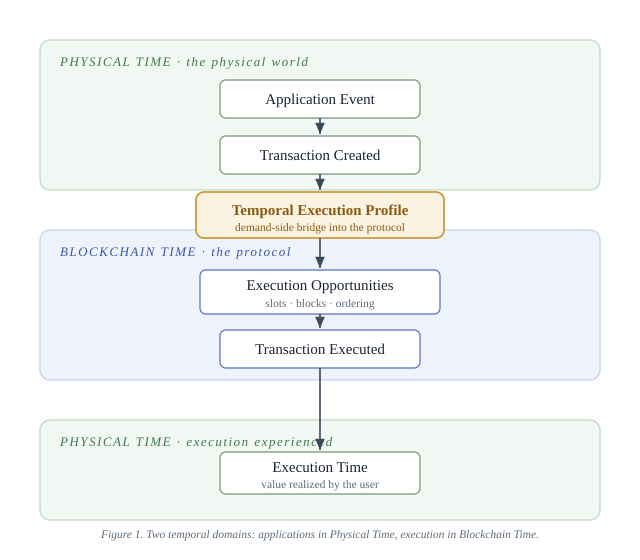

# RN-01 v0.4

# Temporal Execution Profiles (TEP)

## A Demand-Side Communication Model for the Temporal Liquidity Market

**Temporal Liquidity Market (TLM) Research Program**  
**Research Note RN-01**  
**Version:** 0.4  
**Status:** Public draft - research note, offered in good faith for comment  
**Date:** August 19, 2026

---

# Abstract

Blockchain execution markets have evolved significantly through advances
in pricing and execution allocation. This research note investigates a
complementary direction: improving how applications communicate
transaction execution preferences before allocation begins.

Blockchain applications increasingly exhibit heterogeneous execution
requirements. Some transactions derive value only from immediate
execution, while others remain economically valuable across broader
execution windows. Current blockchain fee markets primarily communicate
willingness to pay through a small number of fee parameters, leaving
much of an application's temporal execution preference implicit.

This note introduces the concept of a **Temporal Execution Profile
(TEP)** as the demand-side communication model within the Temporal
Liquidity Market (TLM). Applications formulate execution requirements in
**Physical Time**, while blockchain protocols allocate execution in
**Blockchain Time**. The role of the Temporal Liquidity Market is to
economically coordinate these two temporal domains through market
allocation.

Although Ethereum serves as the primary case study throughout this note,
the broader concepts are intended to encourage comparative investigation
across other Layer-1 blockchain ecosystems.

------------------------------------------------------------------------

# 1. Introduction

Ethereum has evolved from first-price auctions through EIP-1559 and PBS
toward current research on ePBS, execution tickets and slot auctions.
These developments primarily improve **pricing and allocation**.

This note asks a complementary question:

> Before improving allocation mechanisms, should blockchain execution
> markets first improve how applications communicate their execution
> preferences?

The TLM research program studies this demand-side question.

------------------------------------------------------------------------

# 2. Motivation

Applications possess heterogeneous temporal requirements.

  Application           Desired Execution
  --------------------- -----------------------------
  Liquidation           Immediate
  DEX Swap              Within about one minute
  Treasury Settlement   Before market close
  Oracle / NAV Update   Before next reporting cycle

Current fee markets primarily observe:

``` text
maxFeePerGas
maxPriorityFeePerGas
```

These parameters reveal willingness to pay. A one-shot next-block bid
does not, however, encode a full **intertemporal** preference schedule:
how value varies across *when* execution occurs. Repeated bidding,
replacement strategies, and account abstraction recover part of this over
time, and the limits of one-shot fee bidding are documented in the
fee-market literature; the point here is the narrow one, that a single
scalar bid does not express the schedule directly.

Applications therefore implement retries, gas estimation, batching,
oracle scheduling, rollup scheduling and private order flow outside the
protocol.

Heterogeneous temporal demand is already well recognized, and it is one
of the forces behind the proliferation of Layer-1 chains beyond Ethereum:
chains differentiate in part to serve execution and temporal needs that a
single general-purpose fee market serves poorly. That proliferation
fragments liquidity, which works against the original motivation for
decentralized blockchains and wastes resources. One goal of the TLM
program is to express this heterogeneity *within* a shared interface, so
differentiated demand can be served without splintering into isolated
chains, consolidating liquidity and network effects rather than
fragmenting them. Temporal Execution Profiles are a candidate for that
shared, cross-chain vocabulary (sec. 7, sec. 9).

------------------------------------------------------------------------

# 3. Temporal Execution Profiles

A **Temporal Execution Profile (TEP)** is a protocol-visible description
of **how an application's economic value varies with alternative
execution outcomes over Blockchain Time.**

A TEP captures application demand without prescribing either the
mathematical representation or the allocation mechanism.

Execution remains the responsibility of the **Temporal Liquidity
Market**.

This separates

-   application intent,
-   demand representation,
-   market allocation,
-   protocol implementation.

A TEP is **transaction-level**. Stream-level properties (cadence,
persistence, predictability, forecast reliability) belong to the
**Temporal Stream Profile (TSP)** developed in RN-02; the two are
complementary, and RN-02 treats their interaction.

Representation-neutrality (sec. 5) is the interface goal, but a note
cannot be neutral over nothing. As a minimal, **illustrative** anchor,
not a commitment, one transaction-level profile might carry:

-   an eligibility / commitment certificate (when the transaction
    becomes admissible),
-   a resource-demand vector,
-   an admissible execution set or deadline,
-   a value (or bid) over a small finite set of service outcomes,
-   expiry, cancellation, and fallback behavior.

**Every time-valued field here is expressed in blockchain time, not
physical time** (sec. 4). A deadline is a block height or slot index, not
a wall-clock instant, so it is exact and identical on every node. Where an
application's target is physical, the mapping to a blockchain-time
declaration is the application's to make, and the error in that mapping is
carried on the demand side rather than by the protocol.

This anchors the abstraction as a concrete object while leaving the
mathematical representation open.

------------------------------------------------------------------------

# 4. Physical Time and Blockchain Time

Applications derive economic value in **Physical Time**, but "Physical
Time" is not a single primitive. The event that matters may be a
wall-clock deadline, a consensus height, an oracle-certified external
event, or a private economic state, and the protocol cannot directly
observe all of these. The mapping from a physical target to a protocol
outcome therefore carries error, and the note should say who supplies
each target and how it is authenticated.

Blockchain protocols allocate execution in **Blockchain Time**, which is
itself several distinct stages rather than one: **eligibility**
(admissible for inclusion), **assignment** (placed in a slot or
position), **execution**, and **finality**. Ethereum realizes these
through slots, blocks produced within slots, ordering inside blocks, and
finalization; other Layer-1 systems realize them differently while
serving the same roles. Collapsing them into a single "Blockchain Time"
hides distinctions the later notes (RN-09, RN-13) depend on.



The Temporal Liquidity Market economically coordinates these two
temporal domains.

------------------------------------------------------------------------

# 5. Representing Temporal Execution Profiles

A Temporal Execution Profile intentionally separates **temporal execution preferences** from their mathematical representation. Here, temporal execution preference broadly means temporal execution options as there are certain economic trade-off between execution price and execution time. 

Different blockchain protocols may choose different representations while conveying equivalent temporal execution preferences.

Possible representations include

- Temporal Bid Functions,
- execution deadlines,
- acceptable delay intervals,
- discrete execution classes,
- piecewise value schedules,
- protocol-specific encodings,
- or future representations yet to be explored.

Throughout the TLM research program, **Temporal Bid Functions** are investigated as one natural mathematical representation of a Temporal Execution Profile.

The TLM framework intentionally remains representation-neutral.

The abstraction is the **Temporal Execution Profile**.

The representation is an implementation choice.

This separation allows representations and protocol mechanisms to evolve independently while preserving a common conceptual foundation.

------------------------------------------------------------------------

# 6. Economic Motivation for Temporal Execution Profiles

Temporal Execution Profiles are motivated by a simple economic observation.

Applications possess heterogeneous execution preferences, while blockchain execution markets possess heterogeneous execution capabilities.

A market functions effectively only when participants can communicate sufficient information for efficient matching.

Current blockchain fee markets communicate willingness to pay, but communicate only a limited portion of an application's temporal execution options (including but not limited to preferences).

Temporal Execution Profiles investigate whether exposing the temporal execution options between applications (at demand-side) and execution markets (at supply-side) at protocol level may improve this matching before any allocation mechanism is applied.

The objective is not to increase throughput. Nor is it to replace existing fee markets.

Instead, the objective is to improve how execution markets (at supply side) understand the temporal execution options of applications (at demand side) that already exists today.

## 6.1 Demand-side Motivation

Applications today often purchase essentially the execution service in the same manner despite having very different temporal execution requirements and options.

Returning to the examples introduced earlier,

| Application | Primary Requirement/Option |
|--------------|--------------------|
| Liquidation | Execute immediately |
| DEX Swap | Execute within approximately one minute |
| Treasury Settlement | Execute before market close |
| Oracle / NAV Update | Execute before the next reporting cycle |

These applications possess different Temporal Execution Profiles.

However, today's blockchain fee market observes only a limited portion of those profiles.

As a consequence, applications frequently perform temporal optimization outside the blockchain protocol through techniques such as

- gas estimation,
- retry strategies,
- transaction replacement,
- batching,
- rollup scheduling,
- oracle update policies,
- private order flow,
- application-specific scheduling logic.

These techniques are evidence that applications already understand their own temporal execution preferences. Applications are maintaining sophisticated temporal models internally. Those models remain largely invisible to blockchain protocols. 

Temporal Execution Profiles investigate whether part of this information should become protocol-visible. 

The objective is **not** to guarantee execution nor is it to reduce fees for every participant.

Rather, the objective is to allow applications to communicate demand-side temporal execution options to the supply side at protocol level. 

Making part of this information protocol-visible may allow and/or increase economically feasible demand that is currently suppressed or inefficiently expressed to participate in exeuction market more effectively.

If we look from the angle of communicating information in a distributed system, Temporal Execution Profiles seek to reduce information loss between applications and blockchain execution markets.

**Protocol-visible is not the same as publicly revealed.** A deadline or an urgency field also exposes trading intent, and a profile visible in a public mempool before ordering can be priced against or front-run. *When* a field becomes visible is a design lever (committed-and-hidden, builder-visible, consensus-certified, or revealed only after sequencing), and it governs extraction. This note treats revelation timing as an open dimension (RN-02 develops it), not as pure information gain.

**Not every field can be verified the same way.** A useful profile mixes four kinds of field, and the distinction that matters is *when* each can be checked:

- **Certified in advance.** An authenticated deadline. A signature settles it at submission, before anything runs.
- **Checkable only after execution.** Realised resource use. The quantity does not exist until the work has run, so nothing can be signed for it beforehand; it is verifiable, but not in advance. An earlier version of this note grouped resource use with the certified facts, which was wrong: a deadline and a realised cost are checkable at different times, and only one of them can be committed to up front.
- **Observed statistics.** Recurrence, forecast error. Mostly stream-level, so TSP rather than TEP.
- **Never verifiable.** Private value, and the declared preferences that express it.

A missed deadline is observable; the counterfactual value of a different execution time is not, so private value is never directly verifiable. Under the program's marked pricing (RN-02, RN-10/RN-11) this is acceptable: a class is charged at its prevailing marked rate, so selecting an urgent class means paying the urgent rate: a declaration is paid for, not policed. RN-02 sec. 6 develops the field classification and the pricing argument.

The second category is the one the rest of the program leans on hardest, and it is what separates a workable declaration from an unworkable one. Supplied temporal liquidity is checkable after execution, because the chain records where a transaction landed. Urgency is a private counterfactual that never becomes checkable at all. Realised resource use sits with the first of those, not with the deadline it was previously grouped beside.

---------------------------------------------------------------

## 6.2 Supply-side Motivation

Execution providers likewise possess heterogeneous capabilities.

Builders, validators, sequencers, and future execution providers are capable of supporting different execution options.

Current blockchain fee markets, however, primarily optimize immediate transaction inclusion using scalar fee bids.

Consequently, today's execution market effectively offers one dominant execution option:

> Execute as soon as possible.

Temporal Execution Profiles make it possible to explore richer execution options while remaining protocol-neutral.

Illustrative examples include

- immediate execution,
- execution within a specified number of blocks,
- execution before an application deadline,
- preferred execution position,
- flexible execution windows.

These examples are intended only to illustrate the concept.


The broader objective is to allow execution markets to better match heterogeneous application demand with heterogeneous execution options.

Rather than merely redistributing existing demand, richer execution options may expand the economically serviceable market for both applications and execution providers.

This is a **hypothesis**, not a result: whether it holds is measured by deadline-success rates, waiting-time distributions, fee spend, utilization, effects on non-participants, extraction, and computational cost. These are posed as questions for evaluation, not asserted as claims.

This shifts the discussion from competition over a single execution service toward a market capable of supporting differentiated execution services.

------------------------------------------------------------------------

# 7. Relationship to Ethereum Research

Ethereum has continuously improved its execution market through advances in both pricing and allocation.

Early fee markets focused primarily on transaction pricing.

EIP-1559 significantly improved fee predictability and price discovery.

Proposer-Builder Separation (PBS) introduced supply-side specialization, improving execution efficiency.

Current research - including Enshrined PBS (ePBS), execution tickets, slot auctions, and related proposals - continues this evolution by investigating improved allocation mechanisms.

This research note investigates a complementary direction.

Rather than asking

> "How should execution options be allocated?"

it asks

> "How should applications communicate execution preferences before allocation begins?"

Temporal Execution Profiles are proposed as one possible answer to this question.

Accordingly, this work should be viewed as complementary to ongoing Ethereum execution-market research rather than as an alternative to it.

Ethereum serves as the initial case study because it represents one of today's most advanced blockchain execution markets.

The underlying concepts are expected to apply more broadly to future blockchain execution systems. We encourage comparative studies across other Layer-1 blockchain ecosystems.

------------------------------------------------------------------------

# 8. Current Research Directions

This note introduces **Temporal Execution Profiles (TEPs)** as the conceptual foundation of Demand-side communication Model for the Temporal Liquidity Market (TLM) research program.

Building upon this foundation, the project is currently investigating several complementary research directions. These represent active research topics rather than finalized protocol proposals.

| Research Direction | Current Focus |
|--------------------|---------------|
| **Temporal Execution Profiles (TEP)** | Demand-side communication model of transaction execution preferences. |
| **Temporal Bid Functions** | Mathematical representations of Temporal Execution Profiles. |
| **Urgency Pricing** | Mechanisms allowing highly time-sensitive demand to communicate urgency more explicitly. |
| **Patience Incentives** | Mechanisms encouraging flexible demand to reveal temporal flexibility. |
| **Temporal Liquidity Reserve (TLR)** | Protocol-managed temporal balancing mechanisms. |
| **Temporal Market Feedback** | Protocol feedback using observed temporal execution behavior. |
| **Execution Option Markets** | Markets supporting differentiated execution options across time and execution ordering. |
| **Builder Optimization** | Builder optimization using Temporal Execution Profiles rather than scalar fee bids alone. |

These directions document the current research trajectory of the TLM project.

Their purpose is to encourage discussion, invite collaboration, and provide context for future Research Notes and Mechanism Notes.

Individual mechanisms are expected to evolve as the research progresses.

------------------------------------------------------------------------

# 9. Conclusion

Blockchain execution markets have made substantial progress in improving pricing and execution allocation.

This note explores another complementary direction.

Rather than focusing exclusively on allocation mechanisms, future execution markets may also benefit from improving how applications communicate execution preferences.

Temporal Execution Profiles provide one possible framework for communicating those preferences.

Whether TEPs ultimately lead to new pricing models, execution services, scheduling policies, or protocol mechanisms remains an open research question.

The central hypothesis of this work is intentionally modest:

> Better communication of transaction execution preferences may enable better blockchain execution markets.

Stated more sharply, the question is not whether temporal information should be first-class but which **minimum sufficient descriptor** yields a scheduling gain that exceeds its disclosure, extraction, and complexity cost. This is a cost-benefit question the program studies, not a settled result.

While this note focuses on Ethereum, the broader research question is independent of any single blockchain architecture. We hope this work encourages parallel studies across other Layer-1 ecosystems, where different execution models, consensus mechanisms, and application communities may reveal new insights into temporal execution markets. Comparative studies across blockchain platforms may ultimately prove as valuable as the mechanisms proposed within any individual ecosystem. Ultimately, we hope Temporal Execution Profiles evolve into a common vocabulary for discussing transaction execution preferences across blockchain ecosystems, enabling researchers to compare execution markets using a shared conceptual framework while exploring different protocol realizations
---

# Research Philosophy

The Temporal Liquidity Market (TLM) project is developed as an open research program.

It distinguishes between

- Foundation Documents,
- Research Notes,
- Mechanism Notes,
- Protocol Implementations.

Research Notes introduce conceptual ideas.

Mechanism Notes investigate candidate protocol designs built upon those ideas.

Public publication serves two complementary purposes.

First, it establishes a transparent, timestamped record of the project's evolution.

Second, it encourages constructive discussion and collaboration within the broader blockchain research community.

Mechanisms may evolve.

Representations may evolve.

The conceptual foundations are expected to mature through open research, experimentation, and community feedback.

