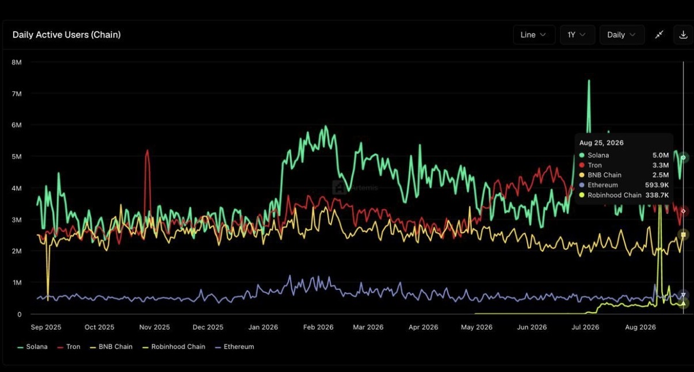
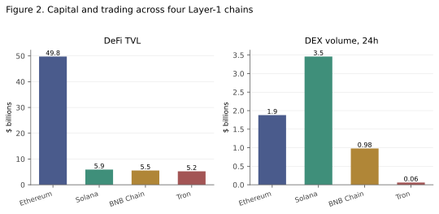
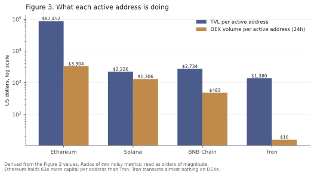

# RN-14 v0.6

# The Demand Ethereum Does Not Serve

## Observed workload differences across four Layer-1 chains and a temporal-demand hypothesis

**Temporal Liquidity Market (TLM) Research Program**  
**Research Note RN-14**  
**Version:** 0.6  
**Status:** Public draft - research note, offered in good faith for comment  
**Date:** September 6, 2026

---

## Abstract

This note compares activity across Ethereum, Solana, Tron and BNB Chain, then asks what the pattern implies for Ethereum. It does not compare consensus designs or headline throughput.

The data show a workload split that is persistent in the one-year active-address series and visible in point-in-time capital and trading measures. Ethereum holds roughly eight times the DeFi capital of its nearest competitor while reporting the fewest active addresses in both sources used here. The relative ranking of Tron and Solana depends on source and date: Artemis places Solana first at the end of its one-year series, while the DeFiLlama snapshot places Tron first. Tron reports little decentralized-exchange volume relative to either address count; whether the remaining activity is primarily payments requires direct transfer data. The chains appear to host different activity mixes, not merely the same activity at different speeds.

Read against Ethereum L1, the split is consistent with a network effect that compounded more strongly in capital than in user activity or trading volume. The aggregate data do not identify migration, unrealized adoption, or causality. They motivate a narrower question: whether the execution and fee interface contributes to the difference after cost, incentives, distribution, geography, and Ethereum's rollup strategy are taken into account.

Sections 8 and 9 take the argument to the individual cases. BNB Chain's position appears closely related to distribution through an exchange, which is a demand-side network effect rather than a nuisance variable. Solana was designed around ordering time in 2017, years before the present workload appeared, and its execution model has since been imported to Ethereum by Eclipse. Tron is treated as a candidate payment case and therefore as a possible source of patient demand for a temporal liquidity market; the classification remains a hypothesis pending direct stablecoin-transfer measurement. Ethereum's relationship with its rollups is examined separately, because an L1-only comparison cannot by itself support claims about the Ethereum ecosystem.

Whether **temporal requirements** explain the split is asked rather than answered. Cost, incentive programs, regulatory geography, distribution, execution design, and Ethereum's L2 roadmap all shape where activity lands, and this note cannot separate their contributions from timing. It establishes a descriptive pattern that warrants measurement, not that Ethereum should recover every missing workload on L1 or that temporal design caused the observed sorting.

---

# 1. Introduction

Blockchain activity has spread across multiple Layer-1 networks. The usual framing asks which chain is winning. This note asks a different question:

> **What kind of execution demand is each chain attracting?**

The reframing matters. The first question invites benchmark comparison. The second invites study of what applications need. If the chains have specialized, the interesting object is not the ranking but the axis along which they separated.

---

# 2. Research Methodology

The claims here are **observational**. They describe what is visible in public chain data and identify a pattern worth explaining. They do not establish cause.

**This is not a controlled comparison.** The chains differ in fee levels, token incentives, regulatory exposure, tooling, funding and ecosystem age. Any of these can move activity.

**The main comparison is Layer 1 against Layer 1.** Unless stated otherwise, “Ethereum” in the quantitative sections means Ethereum L1, not Ethereum plus its rollups. That is appropriate for a base-layer fee-market question but insufficient for claims about the Ethereum ecosystem. A complete comparison needs two panels: L1-only and ecosystem-adjusted. The latter must address duplicated users across bridges and rollups, double-counted TVL, shared liquidity, and differing security classifications. Section 9 discusses the issue qualitatively; this version does not yet supply the second panel.

**The metrics are imperfect.** Active addresses are not people; one operator can control many addresses, and bot and airdrop activity inflates counts differently on different chains. TVL moves with token prices and depends on which protocols a data provider tracks. DEX volume includes wash trading. Each metric is directionally informative and none is precise.

**The windows are not yet uniform.** Active addresses are shown over one year, while the central TVL and DEX comparison is a snapshot. Persistence in the address gap does not establish persistence in every metric. The multi-metric use of “durable” is therefore avoided pending common-window series.

**Timing is inferred, not measured.** Nothing in aggregate data records a transaction's deadline, delay tolerance or sensitivity to ordering. Where this note calls a workload latency-sensitive, that is a reading of what the application does, not a measurement of what it needs. Measuring the temporal characteristics directly requires transaction-level work of the kind proposed in section 13.

The standard for this note is whether it identifies a pattern deserving measurement, not whether it proves a mechanism.

---

# 3. Observations

## 3.1 Active addresses



**Figure 1. One-year daily active addresses by chain.** Artemis, one-year series to 25 August 2026. On the final date the chart shows approximately 5.0M on Solana, 3.3M on Tron, 2.5M on BNB Chain and 594K on Ethereum.

On the final Artemis observation Ethereum reports roughly an eighth of Solana's active addresses. Ethereum remains below the other three chains through the displayed year; the endpoint ratio should not be read as a source-independent user count.

## 3.2 Capital, trading and addresses together

DeFiLlama chain pages, observed 28 August 2026:

| Chain | DeFi TVL | DEX volume 24h | DEX volume 7d | Active addresses 24h |
|---|---:|---:|---:|---:|
| Ethereum | $49.76B | $1.88B | $11.30B | 569K |
| Solana | $5.90B | $3.46B | $21.50B | 2.65M |
| BNB Chain | $5.55B | $0.98B | $8.45B | 2.03M |
| Tron | $5.23B | $0.061B | $0.342B | 3.79M |



**Figure 2. Capital and trading, 28 August 2026.** Two columns from the table above; active addresses are already in Figure 1. The ordering reverses between the panels, with Ethereum leading on capital and Solana on trading. Vertical scales differ.

The address counts here differ from Figure 1 because the dates and methodologies differ. More importantly, the sources reverse the Tron-Solana ranking: Artemis ends with Solana near 5.0M and Tron near 3.3M, while the DeFiLlama snapshot reports Tron at 3.79M and Solana at 2.65M. The stable statement is that both report substantially more active addresses than Ethereum, not which one leads independently of source.

## 3.3 Ecosystem-level ratios

Dividing the stock and flow measures by active addresses gives ecosystem-level normalization ratios. They are not estimates of what a representative address or user owns or does: TVL is a stock, DEX volume and active addresses are flows, the participating populations differ, and one actor can control many addresses. The ratios are shown only as orders of magnitude from one mixed-source snapshot.

| Chain | TVL per active address | DEX volume per active address (24h) |
|---|---:|---:|
| Ethereum | $87,452 | $3,304 |
| BNB Chain | $2,734 | $483 |
| Solana | $2,226 | $1,306 |
| Tron | $1,380 | $16 |



**Figure 3. Ecosystem-level activity ratios.** Log scale, since the values span four orders of magnitude. These ratios do not identify individual behavior or a causal effect of fees.

Three contrasts stand out.

**Ethereum's TVL-to-active-address ratio is 63 times Tron's in this snapshot.** This is consistent with a more capital-intensive ecosystem mix. It does not show that each Ethereum user owns a large position or that the counted addresses supply the TVL.

**In the DeFiLlama snapshot, Tron has 1.43 times more active addresses than Solana and roughly one fifty-seventh of its DEX volume.** This is consistent with a non-DEX workload such as payments, but it does not distinguish payments from exchange operations, bots, account maintenance, staking, or differences in address counting. Direct stablecoin transfer counts, adjusted value, sender and receiver counts, transaction sizes, and exchange-wallet filtering are required before calling it a payment result.

**Solana's DEX volume exceeds Ethereum's in this snapshot on a chain with about a twelfth of the TVL.** The ratio is consistent with a higher-turnover trading mix. A common-window series is needed before calling it durable.

---

# 4. Comparative Interpretation

| Chain | Apparent dominant workload | What that workload appears to need |
|---|---|---|
| Ethereum | Settlement, capital-intensive DeFi | Security and finality; high latency tolerance |
| Solana | Interactive trading | Fast, frequent interaction; short value decay |
| Tron | Stablecoin payments | Low unit cost; deadline-tolerant |
| BNB Chain | Retail DeFi | Low cost; moderate latency sensitivity |

The right-hand column is the interesting one and also the weakest. It reads application behavior rather than measuring demand. It is offered so that it can be checked and disputed.

**One row should be read differently from the others.** BNB Chain's position appears to be driven by onboarding through Binance rather than by any execution property, for reasons set out in section 8.1. Its numbers describe how users arrive rather than what they need, which makes it weak evidence about execution demand and strong evidence about something else.

---

# 5. Rival Explanations

The temporal reading is not the only one available, and the alternatives are strong enough to state before the hypothesis rather than after it.

**Cost.** The simplest explanation for Tron's payment dominance is that transfers are cheap, and the same holds for retail activity on BNB Chain. Fee level is a scalar, well understood, and known to move flow. A temporal explanation must add something beyond what cost already accounts for.

**Incentives and distribution.** Token programs, exchange integrations, wallet defaults and regional distribution direct activity, and several of these patterns coincide with periods of heavy incentive spending.

**Regulatory geography.** Stablecoin flows follow jurisdictions and off-ramps rather than execution characteristics.

**Endogeneity.** The chains shaped their own demand. A chain with sub-second blocks attracts applications needing sub-second blocks, and those applications would not have appeared on a chain without them. Observed workload is partly a consequence of the architecture serving it, the same caution RN-03 applies to Hyperliquid.

**What survives.** Cost alone does not mechanically predict the DEX-volume and active-address ordering in this snapshot. Tron and Solana are both cheap relative to Ethereum yet report different activity mixes. That does not reject cost or consensus explanations: distribution, incentives, application ecosystems, geography, counting methods, and execution design differ as well. Temporal requirements are one candidate sorting variable because the apparent workloads differ in frequency, latency, predictability, and ordering sensitivity.

Whether timing is *the* sorting variable is what remains to be measured.

---

# 6. The Compounding That Did Not Happen

Ethereum was first, and for most of its history it has held the deepest liquidity, the most composable application layer, and the largest developer base. That is the classic setup for a network effect: liquidity attracts applications, applications attract users, users deepen liquidity, and the advantage compounds until it is unassailable.

Part of that happened. Ethereum's TVL is roughly eight times its nearest competitor and the ratio has survived several cycles. Capital compounded as the theory predicts.

The user-side metric did not follow the same pattern. Ethereum reports fewer active addresses than Solana, Tron or BNB Chain through Figure 1's window. This is consistent with stronger compounding in capital than in L1 user activity, but the aggregate series does not identify the mechanism or measure Ethereum's rollup users.

**A distinction worth holding throughout what follows.** Migration and unrealized adoption are different counterfactuals. Some trading protocols, liquidity, and volume moved across chains and can be studied through deployments, bridge flows, and cohorts. The active-address data do not establish whether users defected from Ethereum or first adopted elsewhere. This note therefore uses “competitive loss” and “demand never addressed” as hypotheses requiring different evidence, not as findings from the aggregate snapshot.

**The two network effects are not the same mechanism, and only one of them favours an expensive chain.** Capital network effects reward depth and composability: a large position wants the venue where it can be levered, hedged and unwound against the most counterparties, and it will pay a high per-transaction cost to get there because the cost is small relative to the position. User network effects reward cost and immediacy per interaction, and there the same fee is decisive. A chain can therefore win the first competition and lose the second on identical fundamentals, which appears to be what happened.

The high-value activity that Ethereum did keep has not snowballed either. Trading is the case to watch, because trading is where volume should compound fastest: more liquidity means better prices, which attracts more flow, which deepens liquidity again. Solana currently clears more spot DEX volume in 24 hours than Ethereum does, on roughly a twelfth of the capital. Whatever is driving that loop, it is not running on the chain with the deepest capital.

---

# 7. How Did Ethereum Let This Happen?

There are at least two defensible answers, and they point in opposite directions.

**The first reading is that this was a choice, not a failure.** The rollup-centric roadmap deliberately moved execution off L1 and reframed the base layer as settlement and data availability. On that reading, low L1 address counts are the roadmap working: users were supposed to leave the base layer. The difficulty is that they did not only go to Ethereum rollups. They also went to other Layer 1s, taking their fees, their liquidity and their composability with them. A roadmap that exports execution succeeds only if the exported execution stays inside the security domain, and a large share of it did not.

**The second reading is that the interface did not expose the service some applications needed.** A chain with one execution lane, priced by a scalar fee, gives applications limited means to distinguish urgency from flexibility. This may fit some infrequent, high-value work better than frequent, low-value or position-sensitive work. Whether that mismatch affected chain choice remains to be tested after fees, incentives, distribution, and L2 activity are controlled for.

A third possibility should be kept on the table: some of the departed activity may not be worth having. Wash trading, airdrop farming and bot flow inflate address counts everywhere, and a chain that filters them through cost is not obviously worse off. Establishing how much of the gap is economically real is part of the measurement problem in section 13.

These readings are not exclusive, and this note cannot adjudicate between them. What can be said is that the second is the one the TLM program is equipped to test, because it makes a claim about the interface rather than about strategy.

## 7.1 The design question has a moving answer

What Ethereum was designed to do has changed twice.

The original framing was universal. Ethereum was presented as a general-purpose programmable blockchain, and the implicit claim was that any application could run on it. The rollup-centric roadmap, formalised in 2020, narrowed that deliberately: Layer 1 would provide settlement, data availability and security, while Layer 2s absorbed transaction volume. On that design, low L1 activity is not a failure state. It is the target state.

That position is now itself under revision. On 3 February 2026 Vitalik Buterin argued that "the original vision of L2s and their role in Ethereum no longer makes sense, and we need a new path." His two stated reasons are worth quoting accurately, because they are not the reasons this note arrives at. First, L2s decentralised far more slowly than expected: despite dozens launched, few have reached Stage 1 on his own maturity framework, and he reports at least one saying it may never go beyond Stage 1 because "their customers' regulatory needs require them to have ultimate control." Second, the base layer scaled better than assumed. The gas limit has been rising accordingly, from roughly 60 million after Fusaka in December 2025 toward a widely discussed 200 million.

The two arguments are independent and reach the same place from different directions. Buterin's is about what rollups turned out to be; this note's is about which demand the base layer does not serve. Neither entails the other, which makes their agreement worth more than it would be if one were derived from the other. His proposed direction, that L2s should identify a value add other than scaling and that some belong on a spectrum rather than as branded shards, is also compatible with the reading in section 9 below.

So the answer to whether Ethereum was designed to serve all applications is: originally yes, then deliberately no, and now under active reconsideration. This note's data is evidence in that live argument rather than a comment on a settled design.

The reversal creates a tension that bears on the TLM question. Raising L1 capacity lowers the congestion price of blockspace, which erodes the cost advantage that motivated rollups in the first place. Capacity alone therefore reshuffles where activity sits without settling what service the base layer offers. A chain can be fast and cheap and still express only one temporal profile.

## 7.2 The global mempool is a design commitment, not an accident

The public mempool is a separate matter from the fee market, and it is the part of the architecture that forces every workload into one contention domain.

Every pending transaction is gossiped to every node. That is what makes inclusion permissionless and censorship resistance meaningful, and it is not a defect. But it has three consequences that bear directly on this note. Propagation cost scales with total pending volume regardless of which workload generates it. Every application competes in the same queue whatever its temporal requirements. And the visibility that makes the mempool open is the same visibility that exposes intent to extraction.

Chains that took the latency-sensitive workloads generally do not have a global mempool in this form. Transactions are routed to the current leader instead. That is a real architectural difference, and it is not primarily about block time.

Whether an execution market can offer differentiated temporal service while retaining a global mempool is an open question this note cannot answer. It is the more precise version of "is the mempool hindering scalability," and it belongs in the TLM research agenda.

## 7.3 Ethereum has already adopted multidimensional fees

The claim that Ethereum refuses to change its fee market does not survive contact with the record.

EIP-1559 replaced first-price auctions with a congestion-responsive base fee. EIP-4844 went further and created a *second, independent* fee market for blob data, with its own base fee adjusting on its own congestion signal. That is a multidimensional fee market in production, and it demonstrates that the objections usually raised against adding a dimension, that it is too complex or that users cannot reason about it, were surmountable in at least one case.

What has been added so far are **resource** dimensions: how much execution, how much data. What has not been tried is a **temporal** dimension: when, in what order, with what deadline. The precedent for extending the fee market therefore exists. The open question is not whether Ethereum will adapt its fee market, since it has done so twice, but whether time is the next dimension worth adding.


---

# 8. What Ethereum Might Learn, Chain by Chain

## 8.1 BNB Chain: distribution is a network effect too

BNB Chain is the case this note can least explain by execution characteristics, and the likely reason is that execution is not what drives it.

Binance reports a user base above 300 million with roughly 180,000 new sign-ups per day, and its Web3 Wallet provides one-click access to BNB Chain from inside the exchange interface. Commentary on the chain consistently notes that its growth tracks Binance's ability to recruit traders rather than any on-chain property. The users arrive already onboarded, already holding the gas token, and already inside an application that hands them the chain.

That has an analytical consequence for this note: **the BNB Chain row in section 4 should not be read as a workload signal in the way the others are.** It measures a distribution channel. Its presence in the data is a reminder that onboarding friction may explain more of the cross-chain split than execution characteristics do, which is a rival explanation section 5 states in general terms and which BNB makes concrete.

None of this makes BNB Chain's distribution advantage irrelevant. Distribution can produce a network effect: users attract applications and applications can attract users. The aggregate data are consistent with that loop but do not identify it causally or show that Ethereum lacks an ecosystem-level counterpart.

Distribution and execution cost also interact, and the interaction is the part Ethereum can act on. A one-click funnel converts only if the first transaction is cheap enough not to break the experience. The same funnel pointed at an expensive chain would lose users at the first fee. Distribution brings users to the door; the execution layer decides whether they come through it.

**The wider point is about inclusion and strategy.** Serving a wider range of users may create additional network effects, but scarce L1 capacity has an opportunity cost and not every workload belongs on the base layer. The relevant comparison is between the value created by broader access, the value of displaced execution, and the possibility of serving the same demand through Ethereum L2s.

**A counterfactual.** Would Binance have built a chain at all if Ethereum had served retail users well?

The question cannot be settled, but the record narrows it. Binance announced the chain in April 2020 and launched mainnet that September, into the period when Ethereum fees were at their most punishing and DeFi activity was growing fastest. It launched as Binance Smart Chain and was renamed BNB Chain in 2022. And it was built **EVM-compatible**, so that Ethereum applications could port with minimal modification.

That second fact is the informative one. Binance did not need a different execution model; it copied Ethereum's. What it changed was the fee level and the asset that pays it. The chain is therefore evidence that the EVM was worth copying and Ethereum's cost was not.

The counterfactual splits accordingly. A cheaper and more inclusive Ethereum in 2020 would have removed the opening the chain grew into, and would probably have slowed it considerably. It would not have removed the motive. An exchange that routes its users to Ethereum hands the fee stream to ETH validators and gets no gas asset of its own, so the incentive to own the chain is structural rather than technical.

The limit this places on the argument of this note should be stated plainly. Execution design can determine whether a competing chain has an easy value proposition to grow into. It cannot remove the reason a large distributor would want its own chain in the first place.

---

## 8.2 Solana: designed around ordering time, then imported

**Why it exists at all.** Solana's origin differs from BNB Chain's in a way that matters here. It was not a reaction to Ethereum's fee crisis. Anatoly Yakovenko, an engineer from Qualcomm, published the Proof of History whitepaper in November 2017, roughly three years before mainnet beta in March 2020 and well before DeFi congestion made Ethereum expensive. The bottleneck he identified was the time nodes take to agree on the order of transactions.

That is a temporal premise, stated at inception. Solana was not designed to undercut Ethereum on price; it was designed against a claim about ordering latency, and the low fees follow from the throughput rather than being the objective. Of the obvious candidate explanations for its emergence, cost is a consequence, latency is the design target, and the whole thing was planned years ahead of the demand it now serves.

The contrast with section 8.1 is worth drawing. BNB Chain forked Ethereum's execution model and changed the fee level. Solana changed the execution model and inherited the low fees as a side effect. One competitor was economic and opportunistic, the other architectural and deliberate.

**Which DeFi left, and which did not.** The note's own data suggests DeFi did not migrate as a bloc. Solana carries high DEX volume on comparatively little capital; Ethereum retains the capital. That is a split within DeFi rather than a defection of it: the trading half went and the lending and collateral half stayed.

The two halves have different temporal requirements. An order book needs placement and cancellation faster than a block interval, and a market maker who cannot cancel is exposed on every quote. A lending position is opened, held for weeks, and liquidated occasionally; the only latency-sensitive moment is the liquidation, which is a small fraction of the traffic. If a chain offers one execution service, it will suit one of these and not the other.

This is suggestive rather than conclusive, and the caution of section 5 still applies: Solana is also cheap, and cost alone could produce a similar sorting. What the founding record adds is evidence about what the builders believed the binding constraint to be, and they named ordering time three years before the market demonstrated it.

**Importing the execution.** The question of whether Ethereum could host Solana-style execution rather than compete with it already has a partial answer in production. **Eclipse** runs the Solana Virtual Machine as an Ethereum Layer 2: Solana programs deploy almost unchanged, execution is parallel and sub-second, settlement is on Ethereum, and gas is paid in ETH. It launched to mainnet in November 2024.

"Can Ethereum welcome Solana onto its chain" is therefore not hypothetical; something close to it exists, uses Ethereum for security, and returns fee value to ETH. What remains open is whether it draws meaningful volume, and whether importing the execution model is sufficient without importing the ecosystem, the market makers and the retail flow that surround it.

The execution model was never the hard part to copy. The liquidity and the habits are.

## 8.3 Tron: a candidate source of patient payment demand

An earlier reading of this case treated it as the weakest one, on the grounds that stablecoin transfer is not latency-sensitive and therefore not addressable by execution design. That was too quick.

**The competitor here is not another chain.** Permissionless, cross-border value transfer is the founding use case of the field, stated in the 2008 Bitcoin paper before smart contracts existed, and the incumbent it was proposed against is the banking system rather than a rival ledger.

That contest is barely under way, though how barely depends entirely on which volume figure is used, and the figures differ by orders of magnitude. Three definitions circulate and they are not interchangeable:

| Measure | 2025 figure | What it counts |
|---|---|---|
| Raw on-chain transfer volume | tens of trillions | every stablecoin transfer, including liquidity provisioning, bot flow and MEV |
| Adjusted economic volume | $28 trillion (Chainalysis) | filtered for organic activity: payments, remittances, settlement, treasury |
| Consumer and business payments | roughly $400bn, about 60 percent B2B | transfers made to pay for something |

The claim this section needs is the narrowest one and it survives on any of the three. The World Bank's Remittance Prices Worldwide puts the global average cost of sending $200 at roughly 6.4 percent in 2026. Blockchain rails can move the same value for a small fraction of that, with corridor-level implementations reporting all-in costs well below one percent. Against that cost advantage, payments volume in the narrow sense remains a rounding error on global payment activity, and even the adjusted figure sits at a low single-digit percentage of the cross-border market. Chainalysis projects stablecoin payment volumes matching the card networks somewhere between 2031 and 2039, which is a forecast rather than a measurement but places the contest firmly in the future.

The potential market is large, but these aggregate figures do not show which chain should serve it or on which layer. Which definition a reader uses changes both the estimated scale and the economic interpretation.

That is the scale against which a chain's own fee should be read. For a workload repeated daily, the per-transaction cost is not a detail of user experience; it is a line item in a competitive cost stack against a bank. A chain expensive enough to exclude frequent low-value transfers is not merely losing share to Tron. It is absent from the contest with the incumbent the technology was created to challenge.

The working hypothesis is that many stablecoin transfers are low-value, high-frequency, and relatively flexible about intra-block position. If transaction-level evidence supports it, that makes part of the payment workload a candidate **supply side** of a temporal liquidity market. It does not imply that every payment is patient or that the aggregate Tron activity measured above consists of payments.

A temporal liquidity market needs two sides. Impatient demand takes temporal liquidity; patient demand provides it by yielding contended slots and accepting later ones. This is the two-sided structure developed in **RN-10**, where the economics of the market are set out, and given a formal statement in **RN-11**, where the allocation problem and the term structure that prices it are developed. **RN-04** describes the service classes such a market would offer, **RN-05** the supply-side substrate they would run on, and **RN-12** the mechanism that would clear it.

Some payments may be useful providers in that structure for a specific reason: **their value may be relatively insensitive to position within a block.** That claim should be measured rather than assumed. A transfer can still carry a deadline, depend on confirmation predictability, or be part of a state-dependent sequence. Inter-block deferral is also a stronger commitment than moving several positions later and should not be inferred from intra-block flexibility.

If position has a price, a transaction indifferent to position asks for less temporal service than one that must be early. That does not mean its execution is costless or that block space is unused. In an underfilled block it may use otherwise idle capacity; in a full block it displaces another transaction. A temporal discount is justified only by the value of supplied flexibility and the resulting allocation, not by labeling one application patient.

**Payments may have less direct ordering sensitivity than trading.** A simple transfer has no swap price or liquidation opportunity inside the transaction itself, though surrounding application state, account dependencies, compliance checks, or linked transactions can still make order matter. This makes payments a candidate for later positions, not a class that can be reordered without analysis.

Those positions exist and are visible. Franco and Rogozinski, motivating the mini-blocks design, observe that Ethereum block value concentrates at the top: the first transactions, arbitrage legs, liquidations and oracle-sensitive trades, capture a disproportionate share of what is extracted over a slot, while the rest of the block settles into what they call "a comparatively quiet, lower-value regime." Position at the front is contested. Position further back is not, and that is a statement about competition for position rather than about space going unused.

**So who chooses to go there?** Under the current mechanism, nobody chooses it. Position is a function of the priority fee, and a transaction lands at the back by failing to outbid rather than by electing to wait. Patience is not a purchase; it is an outcome.

The compensation for it is correspondingly thin. A sender who forgoes the tip saves the tip, but still pays a base fee set by congestion they did not create, and receives no commitment about when inclusion happens or whether it happens at all. The most a patient transaction can earn for its patience is the priority fee it declined to pay, and in exchange it accepts an open-ended wait.

Stated that way, the back of the block is a losing position rather than a traded one, and it is unsurprising that applications avoid it. A scalar fee expresses "include me," with nothing attached about position. Position inside the block is not addressable, since no field states a preference over it and no rule obliges a builder to honour one, so the fee cannot say "include me early in the block" either. What it certainly cannot say is "include me in this block, later in it, for a discount," which is the sentence a temporal liquidity provider needs to be able to say. Until that sentence exists, the flow best suited to filling the quiet part of the block has no reason to go there, and the flow least suited to waiting bids the price for everyone.

**What the interface would have to add is easier to state than to design.** It needs some counterpart to the priority fee: a way for a transaction to obtain a lower price in exchange for taking a later position within the slot, and a way for the protocol to check that it did. The second half is what makes it tractable, because where a transaction landed is a fact the block records, while whether it needed to be early is a private counterfactual that no scheme can certify. Only one side of a position market can be audited, and it is the supplying side. That asymmetry is what makes the instrument buildable at all.

Whether such a counterpart should take the form of a payment to the patient sender or a discount on what they pay is a mechanism-design question, and the two differ in more than presentation. This note does not settle it. RN-12 gives the broader conceptual market and RN-15 proposes one block-local authorization and funding rule. The data here supplies a hypothesis those mechanisms must test; it does not establish that the mechanism improves welfare.

**These are daily applications, so repeated friction matters.** A fee acceptable for an occasional treasury settlement may be prohibitive for a daily transfer. Serving such activity can support habit and network effects, but this is an ecosystem-strategy claim rather than proof that the transactions belong on Ethereum L1.

This supplies a possible mechanism for user-side network effects. Repeated use can create balances, defaults, and exposure to other applications. High cost may inhibit that frequency on L1, though the aggregate data do not separate cost from distribution, geography, incentives, or use through rollups.

Payments are a broad and repeated workload. That makes them a possible entry point into an ecosystem, while their appropriate execution layer remains open.

If payment activity forms elsewhere, Ethereum may lose both potential patient flow and a source of daily user habit. That is a strategic possibility, not a measured welfare loss. Delegating payments to rollups may be an intentional specialization if the ecosystem preserves reachability, security, and economic linkage.

**The demand has a name, and it is currency substitution.** The preceding argument treats payments as a workload. In much of the world it is closer to a defence. Where a currency loses value predictably, holding a dollar-denominated token is not a preference among savings vehicles; it is the cheapest available way to not be paid in a depreciating unit. That makes it the least discretionary demand in the category, which is why it grows without marketing and why it does not respond to execution quality on any chain.

The evidence is concentrated and one country carries most of it. In Argentina, **94 percent of peso-denominated crypto trading volume is directed at stablecoins**, the highest share of any major currency tracked. Roughly **20 percent of citizens** used stablecoins as of early 2026, with around 8.6 million Argentines having used cryptocurrency at all, and **31 percent of small retail transactions under $1,000** were settled in stablecoins over 2022 to 2024, second in the region only to Venezuela. Stablecoins accounted for 61.8 percent of Argentine crypto volume against a global average of 44.7 percent.

The pattern is regional rather than national. Goldman Sachs estimates roughly **two thirds of global stablecoin supply is held in emerging markets**, seven of the top ten countries in Chainalysis's 2025 adoption index are developing economies, and the majority of global stablecoin flows by transaction count occur outside the United States. India has ranked first for two consecutive years on an index weighted by purchasing-power-parity income per capita, which is constructed to detect grassroots use rather than institutional flow.

**One finding matters more than the volumes, and it is a natural experiment.** Argentine monthly inflation fell from a peak of 25.5 percent to roughly 2.1 percent by July 2026. **Stablecoin usage kept rising anyway.** Adoption has decoupled almost entirely from the condition that produced it.

This is evidence consistent with persistence in payment habits after the initiating condition weakens. It does not isolate habit from wallet adoption, off-ramps, regulation, or other contemporaneous factors, and it is not direct evidence about Ethereum.

**And daily habits are sticky in a way trading flow is not.** A trader moves to wherever execution is better next week, and the switching cost is a few minutes of setup. A payment habit involves counterparties. Changing it means changing where the people who pay you and the people you pay expect to transact, which is a coordination problem rather than a preference. Saved addresses, wallet defaults, merchant acceptance and payroll arrangements all point the same way.

This may invert a natural assumption about winnability. Trading can move quickly when execution improves. Payment habits depend on counterparties and may be harder to attract. The note does not rank the two by social value; that requires a benchmark covering admitted demand, temporal value, real resource cost, incidence, and fairness.

The practical consequence is that the window does not stay open. Habits formed elsewhere become defaults, and the cost of not serving a daily workload rises the longer it goes unserved.

**Where does it go if the base layer will not have it?** Two destinations, and the comparison is less favourable to rollups than it first appears. A Layer 2 inherits Ethereum settlement, but for a small transfer the marginal security difference between an Ethereum rollup and an alternative Layer 1 is not obviously large. Rollups run their own sequencers, frequently a single one, with their own upgrade keys and bridge exposure. The user is trusting an additional operator either way. When both options add an operator, distribution and cost decide, and Tron has both.

That is the sharper form of the question. It is not why users prefer Tron to Ethereum. It is why they would prefer an Ethereum rollup to Tron, and the answer is not obvious.

**There is also no single rollup to choose.** Ethereum has no official or canonical Layer 2. L2BEAT currently tracks roughly two dozen rollups, a further nine validiums and optimiums, and scores of other scaling projects. For most workloads this is a liquidity inconvenience. For payments it is more than that, because the thing that makes a payment network valuable is the set of people who can be paid, and rollups partition that set. A user on one rollup cannot natively pay a user on another without bridging.

So the comparison is not one chain against another. It is one of many partitions against the whole of Tron, where any user can pay any other user by construction. Fragmentation here is not splitting capital across venues; it is splitting the recipient set, which is the network effect itself.

The Ethereum Foundation treats this as a problem rather than a feature, and has an interoperability roadmap targeting 2026, along with proposals such as the Ethereum Economic Zone and shared sequencing across OP Stack chains. Consolidation around a few large rollups is also expected. Both would narrow the gap. Neither has closed it yet, and a payment application choosing where to deploy today is choosing between a partition and a whole network.

This suggests a counterfactual. Had Ethereum offered one canonical execution environment for this workload, whether on the base layer or as a single designated rollup, the comparison with Tron would have turned on cost and distribution alone. Instead it also turns on reachability, which is the one dimension a payment network cannot compromise on.

**If Tron can serve this workload, what stops Ethereum?** Part of the answer is replication. Tron confirms across a far smaller validator set, and its low cost is partly bought with a weaker decentralisation and security position. That is a real trade and not one Ethereum should want to make.

But part of the answer has nothing to do with replication. Serving users who are flexible about their position does not require fewer validators. It requires a fee market able to tell a patient transfer from an urgent one and to charge it for what it is asking for, which is inclusion rather than priority. Nothing about that is settled by validator count.

**This is where the note meets the roadmap question of section 7.1.** If patient, low-value demand is exported to Layer 2 and then leaves for another Layer 1 regardless, the export achieved neither retention nor revenue, and the security argument that justified it did not bind for this workload. The doubt raised in February 2026 about whether the rollup-centric roadmap should change is, in this narrow case, the same doubt this note arrives at from the activity data.

## 8.4 The pattern across the three

Read together, the three cases suggest different candidate explanations and remedies. Solana supplies an execution-model comparison. BNB Chain supplies a distribution hypothesis. Tron supplies a cost, geography, and possible payments hypothesis. Temporal scheduling could change how flexible demand is priced, but it does not make that demand free to execute or establish that admitting it improves welfare.

The demand worth pursuing is the demand an execution interface could address, whether it left for reasons of that kind or never arrived for them. On the reading above that set is larger than it first appears, because it includes the patient workloads a temporal liquidity market would want on its supply side.

---

# 9. Ethereum and Its Own Layer 2s

The comparisons above set Ethereum against other Layer 1s. The relationship with its own rollups is more complicated, and it bears on the same question.

## 9.1 Blockspace sold wholesale

Ethereum sells blob space to rollups in bulk. Rollups resell execution to users retail. That is a wholesale and retail structure, and it has the properties such structures usually have: the wholesaler earns a thinner margin per unit, sees aggregate demand rather than individual demand, and loses the end-customer relationship.

For a fee market that cannot express temporal demand, this is a workable arrangement. Each rollup is in effect a cost and latency class. An application that cannot afford the base layer chooses one; an application that needs settlement assurance stays. Differentiated service is delivered, but the differentiation happens at the level of *which chain you are on* rather than *what you are asking for*. The choice is made once, by the deployer, for all of an application's traffic, rather than per transaction according to what each transaction actually needs.

That granularity is the same limitation this program identifies elsewhere in coarser form. HyperEVM offers two coupled lanes; the rollup ecosystem offers many, but selecting one means leaving the others, and the selection is not reversible per transaction.

## 9.2 A workaround that defers the fix

The arrangement also relieves the pressure that would otherwise force the base layer to solve the problem directly.

If demand that the fee market prices out has somewhere to go, the fee market never has to learn to price it. Work on native temporal structure, whether finer intra-slot resolution of the kind discussed in RN-05, or the parallel execution and shorter block times that Monad, Aptos and Solana pursued, competes for attention against an approach that appears to be working. The reconsideration described in section 7.1, and the gas-limit increases accompanying it, suggest the pressure is returning rather than that it was permanently relieved.

## 9.3 No canonical rollup, and that was foreseeable

Section 8.3 notes there is no official Layer 2 and that this partitions the recipient set. The point to add here is that fragmentation was not an oversight.

Permissionless rollup deployment was the design. Anyone can launch one, and no single operator holds the position, which was judged preferable to a canonical rollup that would concentrate control. Fragmentation is the predicted cost of that choice rather than a failure to anticipate it.

What is open is whether the cost was priced correctly across workloads. For applications where users bring their own counterparties, fragmentation is an inconvenience. For payments, where the product *is* the set of people reachable, it is closer to a defect. A single design decision was made for a heterogeneous set of workloads, which is the same pattern the rest of this note describes at the level of the fee market.

## 9.4 Security is not uniform across the set

"Inherits Ethereum's security" describes the settlement guarantee, not the operating one, and the distinction is measurable.

L2BEAT classifies rollup maturity in stages, where Stage 0 means a system still controlled by a small number of entities and Stage 2 means one governed by code. As of mid-2026 most rollups remain at Stage 0, including large ZK rollups whose upgrades run through multisig wallets. Only a small number, Arbitrum One and Base among them, have reached Stage 1. None has reached Stage 2.

For a large position, settlement assurance may dominate and the operating risk is worth accepting. For a small daily payment, the calculation is different. The user is comparing a Stage 0 rollup's upgrade keys and single sequencer against an alternative Layer 1's validator set, and it is not obvious which they should prefer. That comparison is the one section 8.3 leaves unresolved, and the stage data is the reason it is unresolved rather than rhetorical.

---

# 10. Can Ethereum Serve Any of It?

Underneath the three paths below sits a prior question that section 7.1 leaves open: what the base layer is for. If it is settlement and security, then the useful question is not how much execution it performs but which execution environments it can host, and Eclipse shows that answer already includes a non-EVM runtime. If it is a general-purpose execution platform, then the temporal interface is a first-order concern rather than a Layer 2 matter. The current reconsideration of the roadmap is, in effect, this question being reopened.

Three paths are available in principle, and they are not mutually exclusive.

**Absorb the execution.** Run the alternative execution model inside Ethereum's security domain, as Eclipse does for the SVM. This preserves settlement, security and ETH as the fee asset while conceding that a different runtime serves the workload better.

**Compete on the advantages Ethereum already holds.** Security, settlement finality and the deepest liquidity are genuine and durable, and for any application whose value depends on them the case is already strong. This path requires no protocol change and has not been sufficient on its own.

**Serve temporal profiles the interface currently cannot express.** This is the TLM program's path and the narrowest of the three. It tests whether some demand is held elsewhere partly because the service on offer does not match its temporal requirements. It does not address demand determined by cost, distribution, jurisdiction, or application network effects, and this note does not estimate the share attributable to each cause.

Whether the third path recovers anything is an empirical question. The value of asking it is that the first two are already being tried, and neither has closed the user gap.

## 10.1 The strategic specialization argument

A reasonable objection is that Ethereum should not try to serve every workload on L1. Its execution capacity is deliberately scarce, EIP-1559 regulates average gas toward a target below the hard block limit, and high-security settlement may be the base layer's comparative advantage. On this view, routine payments belong on rollups or other networks, while L1 concentrates on activity that can justify its opportunity cost.

This note accepts the scarcity premise. It does not follow that the highest fee identifies the highest social value, or that every workload absent from L1 was efficiently excluded. Fees reflect private willingness and ability to pay. They can include urgency, MEV, transfers between traders, and access to private order flow. Conversely, payments and shared infrastructure can create network effects or benefits not captured by the originating transaction's fee.

The useful distinction is among three kinds of absent demand:

1. **Efficiently excluded demand:** its value is below the opportunity cost of scarce L1 resources.
2. **Misallocated demand:** a scalar interface excludes it even though a feasible temporal allocation would create more value.
3. **Strategically delegated demand:** Ethereum intends to serve it through L2 rather than direct L1 execution.

TLM is primarily a hypothesis about the second category. It may affect the boundary between the second and third, but it does not establish that all missing activity belongs on L1. The test is counterfactual: when temporally flexible demand is admitted or moved later, does it use otherwise idle capacity, displace another transaction, or only change order? Any gain must be evaluated against the value of displaced execution, resource and state costs, builder incentives, economic incidence, and fairness.

Capacity, transaction count, fees, and burn therefore cannot decide the strategy alone. The companion benchmark note RN-13-NEW develops a multi-criteria comparison. RN-14 supplies the demand hypothesis; it does not supply the welfare ranking.

# 11. What Comes Next

Mechanism design is treated in RN-12 and, for one block-local construction, RN-15. The questions here determine what those mechanisms would need to demonstrate empirically.

**Throughput, and what this is not.** This is not a throughput argument. The base fee is a controller targeting average gas usage below the hard block limit. Sustained blocks above target raise the base fee and suppress marginal demand; the exact path depends on the starting fee, gas-limit and target settings, block sequence, and demand elasticity. Long-run throughput is principally a protocol parameter, not something a fee-market change can increase on its own. A temporal interface changes **which** transactions occupy the target, **where** they execute, and potentially **what congestion peaks cost**.

The peak may matter for the workload in section 8.3 because it can make a low-value transfer unincludable rather than merely late. Whether temporal smoothing lowers the peak is conditional on fixed total demand, feasible displacement, the initial controller state, and the time horizon; shifting demand can also create a later peak. Any claimed crossover with the base-fee response time requires an explicit simulation and stated parameters. Whether real congestion falls on the useful side is an empirical question this note does not answer.

Beyond the fee level, temporal structure is scheduling information. Knowing which transactions can be deferred, which must stay adjacent, and which are independent is much of what an execution engine needs in order to run work in parallel, and Monad, Aptos and HyperCore each show what becomes available when a chain treats execution scheduling as a design problem rather than a given. Whether temporal profiles can feed that kind of engine, and what that does to throughput, is a direction worth pursuing (RN-06).

**Which workloads are winnable, and in what order.** Section 8.3 suggests that trading may respond more quickly to execution quality, while daily payment habits are held in place by counterparties. This is a claim about mobility, not a ranking of social value. Which workload Ethereum should seek depends on the strategic and welfare benchmark stated above.

**How it fits the existing fee market.** EIP-1559, ePBS, execution tickets and slot auctions improve allocation, and this builds on them rather than replacing them. Temporal classes would interact with the base fee and with proposer and builder incentives, so part of the work is understanding those interactions and what they imply for the mechanisms already in place.

**The mechanism itself.** RN-12 proposes a conceptual two-sided market, while RN-15 collapses temporal demand to one signed field for a block-local construction. Neither establishes that the chosen representation is sufficient or efficient. Every class added costs disclosure, extraction surface, and protocol complexity, so the question remains what the smallest useful set is rather than how much differentiation is possible.

---

# 12. Reproducibility

The snapshot in section 3.2 is point-in-time. The one-year daily series behind it can be retrieved from DeFiLlama's public API:

```text
https://api.llama.fi/v2/historicalChainTvl/Ethereum
https://api.llama.fi/v2/historicalChainTvl/Solana
https://api.llama.fi/v2/historicalChainTvl/Tron
https://api.llama.fi/v2/historicalChainTvl/BSC

https://api.llama.fi/overview/dexs/{chain}?excludeTotalDataChart=false&excludeTotalDataChartBreakdown=true&dataType=dailyVolume
```

**A fourth figure is missing and is the most valuable addition to the next revision.** Stablecoin transfer volume by chain, over one year, from Artemis or the DefiLlama stablecoin series. It is the one series that tests the payments reading of Tron directly rather than inferring it from the absence of DEX volume.

The intended comparison window is 26 August 2025 to 25 August 2026, matching Figure 1. Series should be plotted as daily TVL, daily DEX volume, and 7-day moving-average DEX volume. Adding them would let the derived ratios in section 3.3 be shown as trends rather than as one day's reading, which is the main thing this note is currently missing.

---

# 13. Open Research Questions

Six questions decide whether this note's reading survives. Several could overturn it rather than merely refine it.

1. **Is the address gap economically real?** The comparison in section 3 rests on active-address counts, and those counts include wash trading, airdrop farming and automated flow in proportions that differ by chain. Removing them on a consistent basis is the single measurement most likely to change the conclusion.
2. **Is the split explained by cost and incentive spending alone?** Regressing workload share on relative fee level and on incentive programs tests the cheapest rival explanation, and it is the one a reader will reach for first.
3. **Do the application mixes differ in temporal characteristics at the transaction level, or only in value and frequency?** This requires observed value decay rather than inter-transaction intervals, since only the first is a property of demand rather than of what the chain permits.
4. **Does the result survive an ecosystem-adjusted comparison?** Ethereum L1 should be shown both alone and together with rollups, with explicit treatment of duplicated addresses, bridge activity, shared liquidity, TVL, and security assumptions.
5. **Is Tron activity in fact payment activity?** Stablecoin transfer count, adjusted value, unique senders and receivers, transaction-size distributions, and exchange-wallet filtering are needed before the payment interpretation becomes a finding.
6. **Would temporal differentiation improve allocation rather than transaction count alone?** For each newly served class, measure whether it uses idle capacity, displaces ordinary demand, or only changes execution order, then compare temporal value, real resource cost, builder incentives, economic incidence, and fairness. RN-13-NEW develops this benchmark.

---

# 14. Conclusion

The Layer-1 snapshot shows different combinations of capital, active addresses, and DEX activity, while the one-year address series shows that Ethereum's relative address gap persists in that metric. The available data do not establish a durable multi-metric split, identify payments directly, or reject cost, consensus, distribution, incentive, geography, and ecosystem-strategy explanations.

This note reads the pattern as a reason to test specialization by execution demand and asks whether temporal requirements are part of what separates the categories. It does not establish that they are, that the absent activity belongs on Ethereum L1, or that maximizing transaction count is a suitable objective. Establishing the narrower temporal claim requires the transaction-level measurement set out in section 13 and an evaluation of welfare, displaced demand, resource costs, incidence, and fairness. This note is the argument that those measurements are worth doing.

---

## Data and methodology notes

- The Figure 1 series was supplied by the author and originates from Artemis.
- "Active users" means active addresses under each provider's methodology. One person or automated system can control many addresses, and the inflation differs by chain.
- DeFiLlama defines TVL as assets deposited in tracked protocol contracts, subject to its adapter and category rules.
- DEX volume covers decentralized spot exchange activity tracked by DeFiLlama. It excludes payments, centralized-exchange volume, and application activity that is not a swap.
- The derived ratios in section 3.3 divide one noisy metric by another and compound both error terms.
- Cross-chain comparison is sensitive to address models, bot activity and provider definitions. The argument should be tested against the one-year series, not one date.

## References

- Artemis. *Chain Compare, daily active users.* One-year chart supplied by the author, 25 August 2026. https://app.artemis.xyz
- DeFiLlama. *Chain rankings by TVL.* https://defillama.com/chains (values in sec. 3.2 from the Ethereum, Solana, BSC and Tron chain pages, 28 August 2026; DefiLlama still keys BNB Chain as "BSC")
- DeFiLlama. *DEX volume by chain.* https://defillama.com/dexs/chains
- DeFiLlama API documentation. https://api-docs.defillama.com/
- V. Buterin. Post on the rollup-centric roadmap, X, 3 February 2026. https://x.com/VitalikButerin/status/2018711006394843585 (Quoted in sec. 7.1. Reported by D. Kuhn, *The Block*, 3 February 2026.)
- V. Buterin. *Stages of rollup decentralisation*, 6 May 2025. https://vitalik.eth.limo/general/2025/05/06/stages.html (The maturity framework behind the Stage 0 / Stage 1 / Stage 2 classification used in secs. 7.1 and 9.4.)
- *EIP-1559: Fee Market Change for ETH 1.0 Chain*; *EIP-4844: Shard Blob Transactions* (independent blob fee market). Referenced in sec. 7.3.
- Ethereum Foundation. 2026 protocol roadmap and gas-limit trajectory following Fusaka, December 2025. Referenced in sec. 7.1.
- A. Yakovenko. *Solana: A new architecture for a high performance blockchain*, whitepaper, November 2017; mainnet beta March 2020. Referenced in sec. 8.2.
- Eclipse. *SVM Layer 2 on Ethereum.* Mainnet beta November 2024; Solana Virtual Machine execution with Ethereum settlement and ETH as the gas asset. https://www.eclipse.xyz
- M. Franco and G. Rogozinski. *Mini-Blocks: SSV-Backed Sub-Slot Auctions for Ethereum PBS.* Ethereum Research, May 2026. https://ethresear.ch/t/mini-blocks-ssv-backed-sub-slot-auctions-for-ethereum-pbs/24898 (Top-of-block value concentration; quoted in sec. 8.3.)
- L2BEAT. *Layer 2 ecosystem tracker*, rollup and validium counts, 2026. https://l2beat.com Referenced in sec. 8.3.
- Ethereum Foundation. *L2 interoperability roadmap* and the Ethereum Economic Zone proposal, 2026 (secondary coverage). Referenced in sec. 8.3.
- World Bank. *Remittance Prices Worldwide*, global average cost of sending $200, 2026. Referenced in sec. 8.3.
- Chainalysis. *The $100 Trillion Wealth Shift: Stablecoin Utility and the Future of Payments*, 8 April 2026. https://www.chainalysis.com/blog/stablecoin-utility-future-of-payments/ (Adjusted stablecoin volume of $28 trillion in 2025, the raw-versus-adjusted distinction, and the 2031 to 2039 projection for matching card-network volumes. Table in sec. 8.3.)
- Narrow consumer and business stablecoin payments volume for 2025, roughly $400bn with a majority in B2B (industry estimates; the definitional caveat is stated in sec. 8.3 rather than resolved).
- Binance. *Binance Smart Chain launch*, announced April 2020, mainnet September 2020; EVM-compatible by design; renamed BNB Chain in 2022. Referenced in sec. 8.1.
- Binance. *Web3 Wallet and exchange onboarding.* Reported user base above 300 million; commentary on BNB Chain growth tracking exchange recruitment (sec. 8.1). https://www.bnbchain.org
- TLM Research Program. RN-01 (Temporal Execution Profiles); RN-02 (protocol-visible temporal abstraction); RN-03 (Hyperliquid case study, and the endogeneity caution of sec. 5); RN-04 (temporal execution services and the service-class portfolio); RN-05 (supply-side granularity and the quantum lattice); RN-06 (Monad, parallel execution); RN-09 (chain virtualization); RN-10 (economics of the temporal liquidity market, and the two-sided structure of sec. 8.3); RN-11 (the allocation problem and the term structure that prices it); RN-12 (mechanism design).
